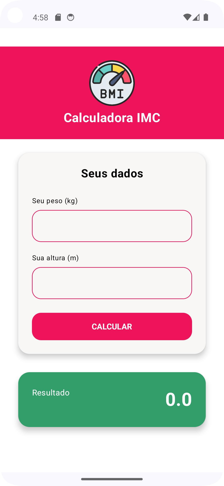
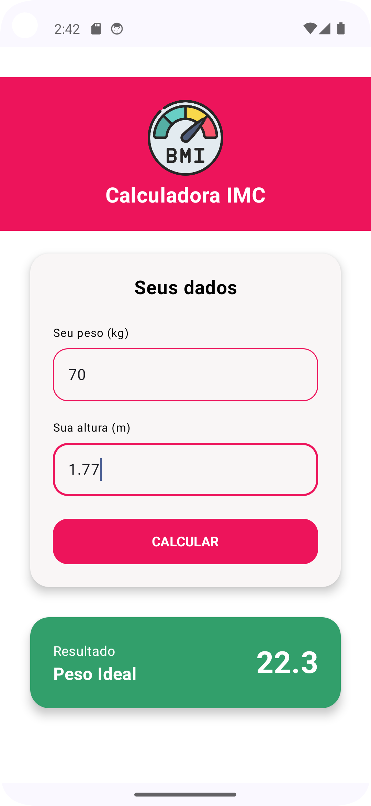

# Android IMC App

Aplicativo Android desenvolvido em **Kotlin com Jetpack Compose** para cálculo do **Índice de Massa Corporal (IMC)**.  
O app permite que o usuário insira seu **peso** e **altura**, calcule o IMC automaticamente e visualize sua **classificação de saúde** conforme o resultado.

---

## Funcionalidades

- Entrada de **peso (kg)** e **altura (cm)**
- Cálculo automático do **IMC (peso / altura²)**
- Exibição do resultado com **formatação decimal**
- Classificação conforme a tabela da OMS:
    - Abaixo do peso
    - Peso normal
    - Sobrepeso
    - Obesidade Grau I, II ou III
- Interface moderna com **Material Design 3**
- Tema personalizado (**vermelho FIAP** e tipografia ajustada)

---

## Telas da aplicação
<div align="center">
  
  
</div>


## Tecnologias Utilizadas

- **Kotlin**
- **Jetpack Compose**
- **Material 3 (Compose Material3)**
- **Android Studio Iguana / Jellyfish**
- **Gradle**
- **ViewModel + State Management com remember/mutableStateOf**

---

## Estrutura Principal

### `MainActivity.kt`
Define o ponto de entrada do app e o tema principal.

```kotlin
setContent {
    AndroidimcappTheme {
        Scaffold(modifier = Modifier.fillMaxSize()) { innerPadding ->
            ImcScreen(modifier = Modifier.padding(innerPadding))
        }
    }
}
```

## Estrutura Principal
A interface utiliza Componentes Compose, com destaque para:
- `OutlinedTextField`para entrada de dados
- `Button`estilizado com `RoundedCornerShape
- `Card` para exibir resultado com destaque
- `colorResource` e `painterResource` para cores e ícones personalizados

## Cálculo do IMC
```kotlin
fun calcularImc(peso: Double, altura: Double): Double {
    val alturaMetros = altura / 100
    return peso / (alturaMetros * alturaMetros)
}

fun determinarClassificacaoIMC(imc: Double): String {
    return when {
        imc < 18.5 -> "Abaixo do peso"
        imc < 24.9 -> "Peso normal"
        imc < 29.9 -> "Sobrepeso"
        imc < 34.9 -> "Obesidade Grau I"
        imc < 39.9 -> "Obesidade Grau II"
        else -> "Obesidade Grau III"
    }
}
```
## Estrutura de Pastas
```bash
app/
 └─ src/
     ├─ main/
     │   ├─ java/com/ogustavoress/github/android_imc_app/
     │   │   ├─ MainActivity.kt
     │   │   ├─ ImcScreen.kt
     │   ├─ res/
     │   │   ├─ drawable/bmi.png
     │   │   ├─ values/colors.xml
     │   │   └─ values/themes.xml

```
## Como Executar
1. Clone o repositório:
```bash
git clone https://github.com/ogustavoress/android_imc_app.git
```

2. Abra o projeto no **Android Studio**

3. Execute em algum emulador que use **API 34** (ou dispositivo físico)

4. Clique em **Run**